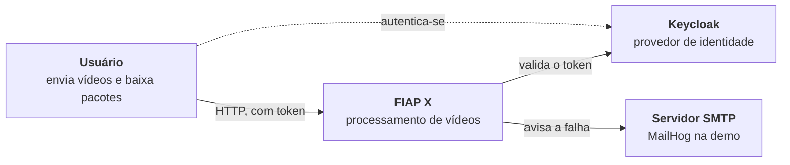
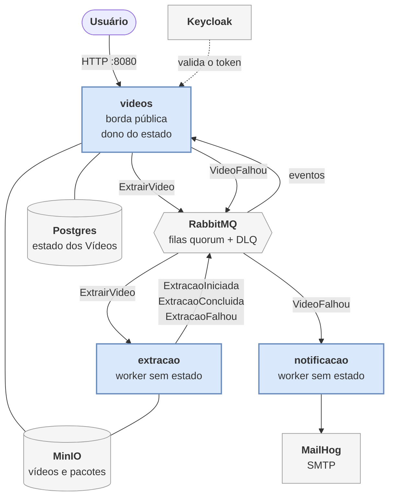
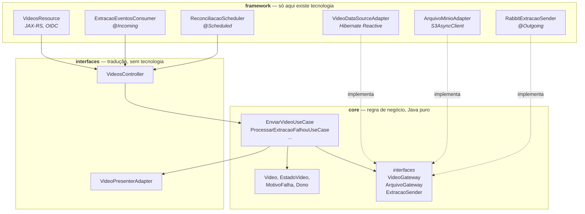
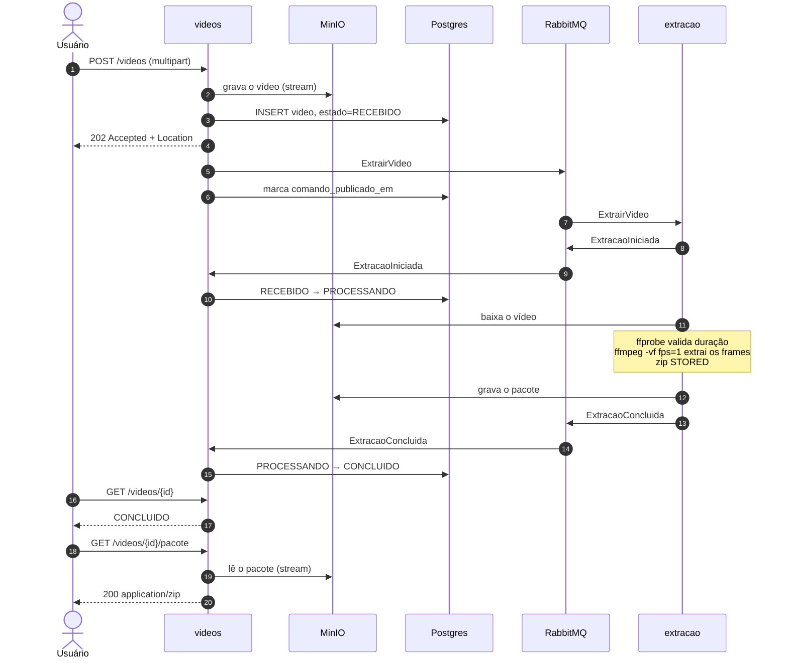
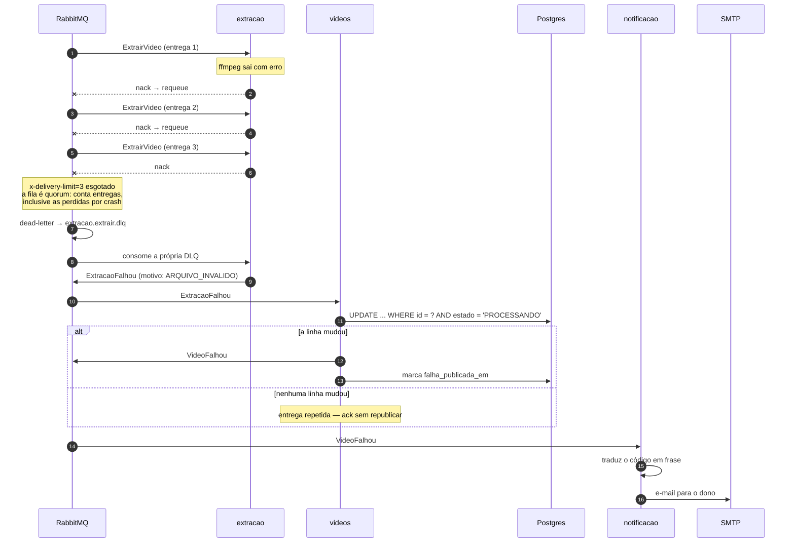

# Arquitetura

O usuário envia um vídeo e recebe um `.zip` com um frame por segundo. O projeto base fazia
isso num único processo Go, de forma síncrona: quem enviava ficava com a conexão aberta até o
`ffmpeg` terminar, e uma falha no meio não deixava rastro. Esta versão faz o mesmo trabalho
com três serviços Quarkus que só conversam por mensagem.

Três decisões estruturais sustentam tudo o que vem abaixo:

1. **O trabalho é aceito antes de ser feito.** O envio responde `202 Accepted` assim que o
   arquivo está durável e o comando enfileirado — não quando a extração termina.
2. **Um único serviço é dono do estado.** O `videos` é a borda pública e a única autoridade
   sobre o que aconteceu com um Vídeo; `extracao` e `notificacao` não têm banco.
3. **Cada serviço é Clean Architecture, verificada por teste.** A regra de dependência não é
   convenção documentada: é um teste que reprova o build.

Este documento é a visão de conjunto. Cada afirmação aqui tem o raciocínio inteiro em algum
outro arquivo do repositório, e aponta para ele em vez de repeti-lo.

## Contexto

O sistema não guarda senha e não tem cadastro de usuário: a identidade vem inteira do token,
e o dono de um Vídeo é o `sub` do token de quem o enviou — nunca um campo do request.

## Containers

Três coisas nesse desenho não são acidentais.

**Nenhuma seta liga `extracao` a `notificacao`.** O worker que descobre a falha não é quem
avisa o usuário. Toda falha volta para o `videos`, que decide se ela é notícia — e é essa
volta que impede o e-mail duplicado, como a seção de escalabilidade detalha.

**O conteúdo do vídeo nunca entra numa mensagem.** O que circula pelo RabbitMQ é a chave do
objeto no MinIO. Um arquivo de 200 MB numa fila seria um problema de memória do broker, não
de arquitetura.

**O `extracao` não tem banco.** Ele recebe as chaves prontas, trabalha e relata. Não conhece
a convenção de nomes dos objetos, não sabe quem é o dono do Vídeo, e não guarda progresso —
o que é exatamente o que permite matá-lo e subir outro no lugar.

Contratos completos: [HTTP](contratos/http-videos.md) e
[mensagens](contratos/mensagens.md).

## Por dentro de um serviço

Todos os três têm a mesma forma. Abaixo, o `videos`, que é o mais completo — os outros dois
são o mesmo desenho sem borda HTTP e sem banco.

As setas cheias apontam para dentro; as pontilhadas são implementações que o `core` só
conhece como interface. O `core` não importa JAX-RS, CDI, Hibernate nem Mutiny — ele fala
`CompletableFuture`, não `Uni`, justamente para não conhecer o reativo do Quarkus.

Isso não é aspiração. `ArchitectureConstraintsTest` verifica o layout dos pacotes, os imports
proibidos em `core` e `interfaces`, e onde cada tecnologia pode aparecer — `@Incoming` e
`@Outgoing` só em `framework`, `ProcessBuilder` só em `framework`, `@Scheduled` só em
`framework`. Ele roda no `verify`, existe em cópia idêntica nos três módulos, e um `cmp` na
fase `validate` do agregador reprova o build se as cópias divergirem.

O ganho prático aparece nos testes: o `core` inteiro roda com dublês em memória, sem Docker.
Dos 130 testes do projeto, 96 não sobem container nenhum.

## O caminho feliz

O `202` sai no passo 4, antes de qualquer trabalho de vídeo existir. Do passo 5 em diante o
usuário já foi embora — é por isso que a listagem de status é um requisito e não um luxo: ela
é o único canal pelo qual ele descobre o desfecho.

O download é **stream de ponta a ponta**, não presigned URL, e nunca carrega o arquivo em
memória: `fromFile` na entrada, `toPublisher` na saída.

## O caminho de falha

Duas coisas merecem atenção aqui.

**A garantia de e-mail único não está no `notificacao`.** Ele é *pelo menos uma vez* por
desenho e não guarda nada. Quem não deixa a notificação se multiplicar é o `UPDATE`
condicional no `videos`: ele exige no `WHERE` o **estado predecessor** — `FALHOU` só é
alcançável a partir de `PROCESSANDO` —, então só a primeira entrega muda a linha, e só a
transição que mudou a linha publica `VideoFalhou`. A segunda e a terceira entrega da mesma
mensagem não casam o predicado, não mudam nada e dão ack em silêncio. O grafo de transições é
declarado uma vez só, em `EstadoVideo.predecessor()`. Isso é o que dispensa
banco no `notificacao` e torna todo consumo de evento idempotente
([ADR 0001](adr/0001-politica-de-falhas.md), [ADR 0002](adr/0002-maquina-de-estados-em-duas-camadas.md)).

**Uma tentativa é uma entrega, não um erro.** Se o worker morre no meio da extração, aquela
tentativa foi gasta ainda que nada estivesse errado com o vídeo. É deliberado: um arquivo que
derruba o worker repetidamente esgota as tentativas e falha, em vez de derrubar o worker para
sempre.

## Escalar, e não perder requisição em pico

Os dois requisitos que não aparecem numa demonstração. Ambos têm mecanismo, não promessa.

### O que escala, e como

| Serviço | Escala | Por quê |
|---|---|---|
| `extracao` | réplicas, **linear até 6 réplicas nesta máquina** | sem estado, `max-outstanding-messages=1` — cada réplica pega **uma** extração por vez e só volta à fila quando termina. *Competing consumers* puro. **Medido** ([ticket 026](wayfinder/tickets/026-linearidade-horizontal.md)): eficiência de escala 0,99 / 0,90 / 0,88 em 2 / 4 / 6 réplicas, de 2,96 para 15,6 Vídeo/min. Acima disso é desconhecido — os 20 núcleos do host já estavam a 77% |
| `videos` | réplicas | o estado está no Postgres, não em memória; a transição é `UPDATE` condicional, então duas réplicas processando a mesma mensagem chegam ao mesmo resultado. **Nunca medido com réplicas**: o Compose sobe uma réplica só, e derrubá-la custou 361 envios recusados de 400 ([§ O que a medição mostrou](#o-que-a-medição-mostrou)). O que se sabe da réplica única é que ela **não é barata sob rajada**: 16 uploads simultâneos de 41 MB a levaram a ~12 núcleos de pico ([ticket 026](wayfinder/tickets/026-linearidade-horizontal.md)) |
| `notificacao` | réplicas | idempotente por construção — a unicidade mora na transição de estado do `videos`, não aqui |

O `prefetch=1` do `extracao` é a escolha central: extração de vídeo é limitada por CPU e
disco, então buscar dez mensagens de uma vez só faria uma réplica segurar trabalho que outra,
ociosa, poderia estar fazendo. Já o `notificacao` usa `prefetch=10`, porque uma chamada SMTP
é espera de rede.

O gargalo real é o `extracao`, e é exatamente o serviço projetado para ser multiplicado. É
também o motivo de as imagens serem publicadas para `amd64` **e** `arm64`: `ffmpeg` emulado
inviabilizaria o serviço na máquina de quem avalia.

### O que impede a perda

| Janela de risco | O que a fecha |
|---|---|
| Pico de envios | o `202` responde antes do trabalho; a fila absorve o excedente em disco, não em conexões HTTP abertas |
| Broker reinicia | filas **quorum**, replicadas e duráveis — mensagem confirmada sobrevive |
| Worker morre no meio | ack **manual**, depois do trabalho; a mensagem volta para a fila |
| Mensagem envenenada | `x-delivery-limit=3` e DLQ — a mensagem sai do caminho, mas não some: o `extracao` consome a própria DLQ e transforma o esgotamento em `ExtracaoFalhou`, que vira e-mail |
| Falha entre gravar no banco e publicar na fila | duas colunas marcadoras (`comando_publicado_em`, `falha_publicada_em`) e uma varredura a cada 30s republicam o que ficou para trás ([ADR 0003](adr/0003-reconciliacao-por-varredura.md)). **A republicação nunca foi observada acontecendo**: a rodada que existia para exercitá-la não produziu evidência de uma única republicação ([§ O que a medição mostrou](#o-que-a-medição-mostrou)) |

Essa última linha é a menos óbvia e a que mais importa. Gravar no Postgres e publicar no
RabbitMQ não é uma operação atômica: um crash entre as duas deixaria um Vídeo eternamente em
`RECEBIDO` — que, para o usuário, é a requisição perdida que o enunciado proíbe. A marca é o
que separa "publicado e esperando na fila" de "nunca publicado", e é por isso que a varredura
não pode ser por idade: num pico, backlog de fila republicaria comandos que já estão a
caminho.

O regime resultante é **pelo menos uma vez**, assumido e não escondido. *Exatamente uma vez*
foi recusado explicitamente: custaria um outbox canônico com tabela e payload serializado, e
o preço de duplicar um e-mail é menor que o de perder uma falha.

### O que a medição mostrou

A tabela acima descreve mecanismos que existem no código. Um teste de carga
([ticket 025](wayfinder/tickets/025-carga-conservacao.md)) mediu se eles bastam, e a resposta
é **não**.

O que passou: sob rajada de 400 envios simultâneos de 1 MB, a borda devolveu **400 `202`, zero
recusas** — sem `5xx`, sem conexão recusada, sem timeout —, e a fila drenou tudo em 98 s com
quatro réplicas. A primeira linha da tabela se sustenta: o pico vira backlog, não erro.

O que reprovou: `ExtracaoIniciada` e `ExtracaoConcluida` viajam em **filas independentes, sem
ordem entre si**. Quando a conclusão chega primeiro, o `UPDATE` condicional não encontra o
predecessor `PROCESSANDO`, altera zero linhas e a mensagem recebe ack — o desfecho some. O
Vídeo fica em `PROCESSANDO` para sempre **com o Pacote já gravado no bucket** — os censos das
três rodadas somam 46 presos, e a conferência contra o MinIO cobriu 45 deles, todos com o
`.zip` lá. Incidência medida: 11 em 400 sob pico com uma réplica reiniciada, e 34 em
39 depois de o `videos` cair e voltar. Nenhuma varredura existente alcança esse estado: a do
ADR 0003 procura marcas de publicação nulas, não Vídeos parados.

Dois defeitos menores saíram da mesma medição. A marca do ADR 0003 pode **mentir**:
`publish-confirms` é `false` por default no conector RabbitMQ, então o envio completa antes de
o broker confirmar, e três Vídeos ficaram em `RECEBIDO` com `comando_publicado_em` preenchido e
comando nenhum na fila. E a varredura de órfãos no boot do `extracao` apaga o scratch das
réplicas **vivas**, porque o volume nomeado é compartilhado entre elas — um h264 válido chegou
ao usuário como `ARQUIVO_INVALIDO`.

Os três estão em aberto no [ticket 027](wayfinder/tickets/027-melhorias-medidas.md).

Três coisas a medição **não** mostrou, e que valem tanto quanto o que ela mostrou:

- **A varredura de reconciliação nunca foi vista republicando.** Derrubar o `videos` no meio da
  rajada existia para exercitá-la, e o que se observou foi só o defeito da marca falsa: dos 39
  aceitos antes da queda, 2 chegaram a terminal em 450 s, e nenhum artefato da rodada registra
  uma republicação. A linha da tabela acima ficou, portanto, **afirmada e não verificada** — a
  demonstração só é possível depois de corrigidos os dois primeiros defeitos, que envenenam
  justamente o cenário que a exercitaria.
- **A borda é réplica única, e derrubá-la perde envio.** Nessa mesma rodada, 361 dos 400 envios
  não chegaram a ser aceitos — 239 timeouts de conexão, 53 EOF, 46 conexões resetadas, 22
  recusadas. O critério de "zero não-`202`" foi dispensado ali de propósito, porque a queda era
  provocada; o número fica registrado assim mesmo, porque a garantia do enunciado não distingue
  motivos.
- **A latência do `202` não tem orçamento declarado.** Sob 400 conexões simultâneas de 1 MB, a
  rodada limpa deu med 3,3 s / p95 5,5 s / max 6,6 s, e uma segunda rodada da mesma configuração
  deu med 9,8 s / p95 12,4 s / max 14,8 s. A degradação entre rodadas não foi explicada, e é
  suspeita de ser efeito do estado acumulado: nenhuma rodada zera o banco antes de começar.

### E o que a segunda medição mostrou: a linearidade se sustenta

Uma segunda medição ([ticket 026](wayfinder/tickets/026-linearidade-horizontal.md), números em
[`docs/pesquisa/carga-escalabilidade.md`](pesquisa/carga-escalabilidade.md)) varreu réplicas do
`extracao` — `N` em 1, 2, 4 e 6, com teto de 2 CPUs cada, duas repetições por ponto, `down -v`
entre pontos e ordem randomizada. Diferente do 025, esta **confirma** a afirmação da tabela:

| Réplicas | Vazão | Eficiência de escala |
|---:|---:|---:|
| 1 | 2,96 Vídeo/min | 1,00 |
| 2 | 5,87 Vídeo/min | 0,99 |
| 4 | 10,67 Vídeo/min | 0,90 |
| 6 | **15,62 Vídeo/min** | 0,88 |

O critério — eficiência ≥ 0,80 — foi fixado antes de rodar e não é quebrado em nenhum ponto. A
curva entorta entre 2 e 4 réplicas e depois quase para de piorar. O teto **não** é o desenho:
cada réplica passa a não conseguir gastar a própria cota de CPU (de ~196% para ~170%) porque
cada `ffmpeg` abre 20 threads contra uma cota de 2 — em 6 réplicas são ~120 threads disputando
20 núcleos. Isoladamente, fixar `-threads 2` recupera **32%** do tempo de extração, e é
candidato de vazão no [ticket 027](wayfinder/tickets/027-melhorias-medidas.md).

A mesma medição fechou uma das três coisas que o 025 não mostrou: **a degradação suspeita de ser
estado acumulado não existe.** Uma corrida sobre três corridas de lixo (96 Vídeos e 96 Pacotes no
MinIO, 96 linhas na tabela) deu 0,0499 Vídeo/s contra 0,0498 da corrida limpa. A explicação mais
provável para a variância de 3× que o 025 viu é outra, e o 026 a encontrou na própria pele: duas
das doze corridas foram corrompidas pelo **host suspendendo** no meio da medição, o que estica o
denominador sem perder, falhar ou reiniciar nada — nenhum dos cinco critérios de validade pegava
isso, e o harness ganhou um sexto.

Tudo isto está aqui, e não escondido, porque um documento de arquitetura que descreve o
mecanismo e omite a medição que o reprovou é pior que um que não mede.

## Requisitos do enunciado

| Requisito | Como é atendido | Onde |
|---|---|---|
| Processar mais de um vídeo ao mesmo tempo | *competing consumers* no `extracao`, `prefetch=1`, réplicas independentes | [§ Escalar](#escalar-e-não-perder-requisição-em-pico) |
| Não perder requisição em pico | `202` antes do trabalho, fila quorum durável, ack manual, `x-delivery-limit`, reconciliação por varredura — **parcialmente atendido**, ver [§ O que a medição mostrou](#o-que-a-medição-mostrou) | [ADR 0003](adr/0003-reconciliacao-por-varredura.md) |
| Protegido por usuário e senha | Keycloak, OIDC *bearer-only*; o dono vem do `sub` do token | [pesquisa](pesquisa/oidc-keycloak.md) |
| Listagem de status dos vídeos do usuário | `GET /videos` paginado, escopado pelo dono; não existe consulta sem dono na interface do gateway | [contrato HTTP](contratos/http-videos.md) |
| Notificar o usuário em caso de erro | `VideoFalhou` → `notificacao` → SMTP; unicidade garantida pela transição de estado | [ADR 0001](adr/0001-politica-de-falhas.md) |
| Persistir os dados | Postgres para o estado, MinIO para os arquivos | [`docker/postgres/init.sql`](../docker/postgres/init.sql) |
| Arquitetura que permita escalar | serviços sem estado atrás de fila; o único com estado delega ao Postgres | [§ Escalar](#escalar-e-não-perder-requisição-em-pico) |
| Versionado no GitHub | `vandrep/fiapx-v2`, `main` protegida por ruleset, PR obrigatório | [`AGENTS.md`](../AGENTS.md) |
| Testes que garantam a qualidade | 130 testes (96 sem Docker): unitários do `core` com dublês, Cucumber pela borda, teste arquitetural, `ffmpeg` real no `extracao`, e o smoke ponta-a-ponta | [`scripts/smoke.sh`](../scripts/smoke.sh) |
| CI/CD | GitHub Actions: `verify` e publicação das três imagens multi-arquitetura no GHCR | [`.github/workflows/ci.yml`](../.github/workflows/ci.yml) |

Da stack *recomendada*, monitoramento (Prometheus/Grafana) ficou de fora conscientemente —
veja a seção seguinte. Redis também: não há leitura repetida o bastante para justificar
cache, e a consulta de status já é uma linha por chave primária.

## O que foi recusado, e por quê

Cada linha tem a discussão inteira no arquivo apontado.

| Alternativa | Por que não |
|---|---|
| **JavaCV** em vez de `ffmpeg` como processo externo | medido: o processo externo é 3,5× mais rápido e usa 5× menos memória; e o exit code dá de graça a classificação entre falha transitória e permanente ([pesquisa](pesquisa/ffmpeg-extracao.md)) |
| **Presigned URL** para o download | é um *bearer token* na query string e o host entra na assinatura, o que quebra fora do `localhost`; o stream custa uma conexão e não vaza acesso ([contrato HTTP](contratos/http-videos.md)) |
| **Outbox canônico** com tabela e payload | compraria *exatamente uma vez*, regime que o ADR 0001 já recusou; a tabela `video` com duas colunas marcadoras fecha as mesmas janelas sem tabela nova ([ADR 0003](adr/0003-reconciliacao-por-varredura.md)) |
| **Kubernetes** | o enunciado aceita Compose *ou* Kubernetes; Compose garante que a demonstração roda na máquina de quem avalia, sem cluster |
| **Módulo Maven `shared`** com os contratos | duplicar cinco records é mais honesto que acoplar três serviços por um jar; extrair depois, se doer |
| **Prometheus + Grafana** | é stack *recomendada*, não requisito; com o prazo desta entrega, seria o primeiro a canibalizar o tempo do CI/CD, que é requisito. Health checks ficaram — e são o que o Compose usa para ordenar a subida |
| **E2E automatizado no CI** | Compose inteiro num runner (ffmpeg + MinIO + Keycloak + RabbitMQ) é fonte de instabilidade que não acrescenta garantia; `scripts/smoke.sh` faz a mesma verificação onde ela é confiável |

## Limitações conhecidas

O que eu não defendo — apenas aceitei.

- **O e-mail é *pelo menos uma vez*.** A garantia de unicidade cobre a repetição de mensagem,
  não uma falha entre publicar `VideoFalhou` e o SMTP aceitar. Numa janela estreita, o
  usuário pode receber o aviso duas vezes. Foi escolha consciente: duplicar um aviso é melhor
  que engolir uma falha.
- **A conservação sob pico foi medida e reprovou.** O sistema perde requisição quando o evento
  de conclusão chega fora de ordem — 11 em 400 sob pico com falha injetada. Diagnóstico e
  números na seção [§ O que a medição mostrou](#o-que-a-medição-mostrou); correção em aberto no
  [ticket 027](wayfinder/tickets/027-melhorias-medidas.md). É a limitação mais séria desta
  lista, e a única que contraria um requisito explícito do enunciado.
- **A borda é réplica única, e a varredura de reconciliação nunca foi vista funcionando.** O
  Compose sobe um `videos`; derrubá-lo durante uma rajada custou 361 envios recusados de 400,
  e a rodada que existia para exercitar a varredura do [ADR 0003](adr/0003-reconciliacao-por-varredura.md)
  não registrou uma única republicação. Escalar a borda por réplicas é afirmação de desenho,
  não medição.
- **A latência do `202` não tem orçamento declarado.** Ela foi medida (med 3,3 s sob 400
  conexões simultâneas de 1 MB) e variou até 9,8 s entre rodadas de mesma configuração. O
  [ticket 026](wayfinder/tickets/026-linearidade-horizontal.md) descartou a hipótese de estado
  acumulado, mas continua não havendo limiar contra o qual julgá-la.
- **A linearidade horizontal foi medida até 6 réplicas, e além disso eu não sei.** Ela se
  sustenta (eficiência 0,88 em 6 réplicas, acima do critério de 0,80 fixado antes de rodar), mas
  em 6 réplicas o host já estava a 77% dos 20 núcleos: `N=8` é onde a folga acabaria, e não foi
  medido. Nada aqui diz o que acontece em máquina de outro porte, com MinIO remoto, ou com
  Vídeos de durações misturadas — todos os Vídeos de uma corrida eram o mesmo arquivo. Números em
  [`docs/pesquisa/carga-escalabilidade.md`](pesquisa/carga-escalabilidade.md). E `--scale
  extracao=N` continua com o defeito conhecido de as réplicas compartilharem o volume de scratch
  ([ticket 027](wayfinder/tickets/027-melhorias-medidas.md)); a varredura o contornou por
  protocolo, não o corrigiu.
- **Não há observabilidade além de health check.** Sem métrica, sem tracing distribuído. Num
  sistema assíncrono com DLQ, a primeira coisa que eu acrescentaria com mais tempo seria
  visibilidade sobre profundidade de fila e taxa de dead-letter.
- **O fluxo entre os três serviços não roda no CI.** `./mvnw verify` testa cada serviço
  isolado; que eles conversam é verificado por `scripts/smoke.sh`, que alguém precisa rodar.
- **O caminho de tentativas esgotadas não é testado automaticamente.** Exigiria derrubar o
  consumidor no meio de três entregas. Foi percorrido à mão contra um broker real.
- **Sem Flyway.** O banco nasce de [`docker/postgres/init.sql`](../docker/postgres/init.sql),
  mantido honesto pelo `%prod.quarkus.hibernate-orm.schema-management.strategy=validate`. Uma tabela
  não paga um datasource Agroal só para migrar; o dia que pagar, é Flyway.

---

Cada decisão deste documento tem a discussão que a produziu registrada em
[`docs/wayfinder/map.md`](wayfinder/map.md) — 24 tickets, com as alternativas consideradas e
o que foi medido em cada um.
